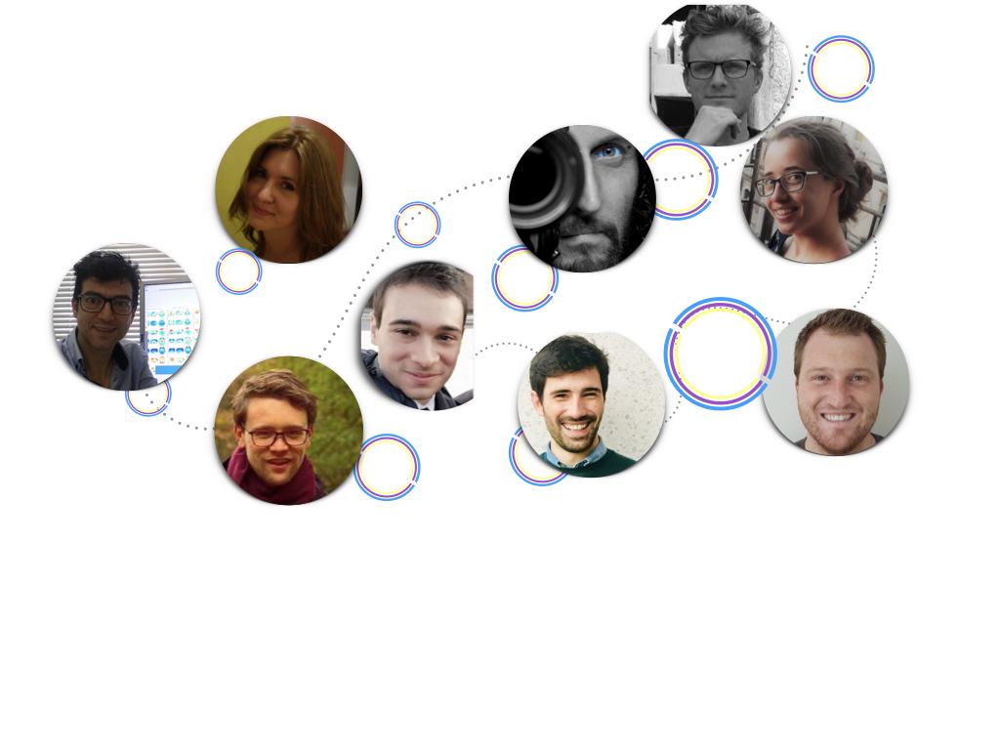

##  OpenMR Benelux 2020  

Excited about an open world, where ideas and tools are shared, and collaboration-based development is standard in the magnetic resonance imaging (MRI) community?

 

Us too! And that is what the OpenMR Benelux is all about. Let’s open up this discussion!

For the second time OpenMR Benelux organizes a meeting concerning open MRI science. This year’s event, <a href="./page-openmrb-2020"><b>OpenMR Benelux 2020</b></a>, will be an exciting 3-day program lined up with talks, discussions, workshops, training sessions, and <a href="./page-resources-hackathon">hackathons</a>! We invite you to join us and a team of amazing MRI researchers and developers to learn, speak up, develop, and discuss open (MRI) science practices!

OpenMR Benelux 2020 will be hosted at the <a href="https://www.ru.nl/donders/">Donders Institute for Cognition, Brain and Behaviour</a> in Nijmegen, The Netherlands, on 21-23 January, 2020. Head over to the <a href="./page-openmrb-2020"><b>Event Page</b></a> or check out the <a href="./page-program"><b>Program</b></a> for more details!

<a href="./page-registration"><b>Registration</b></a> <b>is open</b>!

 

##  Who are we?   

We are a community of students, research faculty, and professionals who want to create an open forum for people working in MRI research to learn about and discuss open science practices.

 

We focus on working together on implementable solutions in all forms: software toolboxes, process descriptions, community projects, knowledge-sharing initiatives, and more. Open discussion is central to our event and we foster open-minded attitudes and a readiness to participate. Interested in joining? See our next event! Want to see the people working hard in the background to make this a success? Meet the <a href="./page-team">Team</a>!

 

The first edition of OpenMR Benelux in 2019 was a blast! You can check out last year’s program, speakers, and more at <a href="https://openmrbenelux.github.io/openmrb2019/">OpenMR Benelux 2019</a>.

 

 
<a href="#"><i class="fas fa-arrow-alt-circle-up" style="position: relative; top: -3px; text-indent: 0px; vertical-align: middle; color:#004777;"></i></a>
