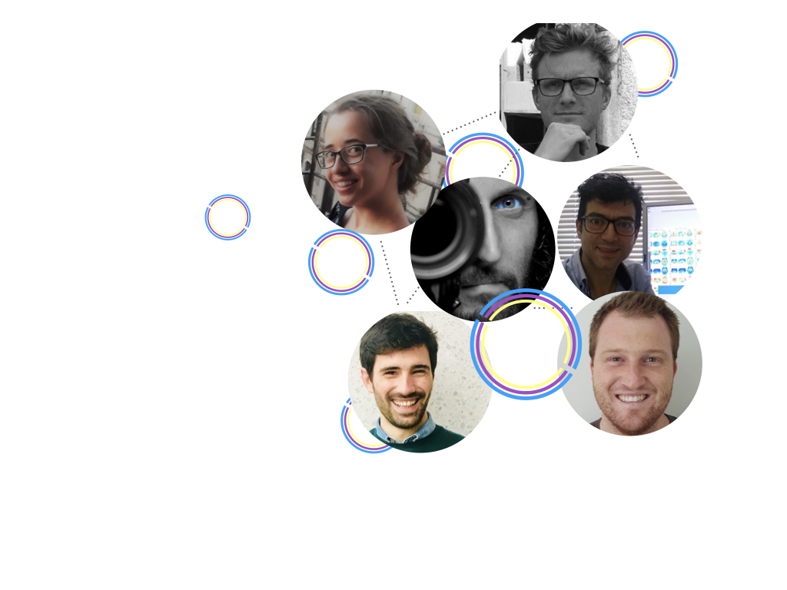

<!-- https://stackoverflow.com/questions/13476267/hide-div-element-when-screen-size-is-smaller-than-a-specific-size/13476297 -->
<!-- display only if screen width is larger than 900px -->

<h2>  <i class="fas fa-level-down-alt fa-flip-horizontal"></i>  OpenMR Benelux 2021  &nbsp;&nbsp;<i class="fas fa-robot"></i> &nbsp;has transformed into&nbsp; <i class="fas fa-robot"></i>&nbsp;&nbsp;  OpenMR Virtual 2021 <i class="fas fa-level-down-alt"></i>  </h2>

<h2>  <i class="fas fa-long-arrow-alt-right"></i>&nbsp;&nbsp;FREE OF CHARGE&nbsp;&nbsp;<i class="fas fa-long-arrow-alt-left"></i>  </h2>

<!-- display only if screen width is smaller than 900px -->

<h2>  OpenMR Benelux 2021   &nbsp;&nbsp;<i class="fas fa-robot"></i> &nbsp;has transformed into&nbsp; <i class="fas fa-robot"></i>&nbsp;&nbsp;   OpenMR Virtual 2021  </h2>

<h2>  <i class="fas fa-long-arrow-alt-right"></i>&nbsp;&nbsp;FREE OF CHARGE&nbsp;&nbsp;<i class="fas fa-long-arrow-alt-left"></i>  </h2>

<!-- both: horizontal lign -->

 

##  OpenMR Virtual 2021 

<a href="https://twitter.com/openmrbenelux?ref_src=twsrc%5Etfw" class="twitter-follow-button" data-show-count="false">Follow @openmrbenelux</a>

<!--  -->

<div_twitter id="twitter_moment" style="float: right;">

  <!-- https://publish.twitter.com/ -->

    <a class="twitter-timeline" data-lang="en" data-width="270" data-height="500" data-theme="light" href="https://twitter.com/openmrbenelux?ref_src=twsrc%5Etfw">Tweets by openmrbenelux</a> 

</div_twitter>

Excited about an open world, where ideas and tools are shared, and collaboration-based development is standard in the Magnetic Resonance Imaging (MRI) community?

 

Us too! And that is what OpenMR Benelux is all about. Let’s open up this discussion!

For the third year in a row, OpenMR Benelux organizes a meeting concerning open MRI science but this year, we're going virtual. That's right: OpenMR Benelux 2021 has transformed into <b>OpenMR Virtual 2021</b>! We invite you to join us and a team of amazing MRI researchers and developers to learn, speak up, develop, and discuss open (MRI) science practices. It doesn't matter whether you are from the Europe, Middle East, and Africa (EMEA) region or a night zombie who would like to attend from further away. <b>We are welcoming you all</b>!

The best part: OpenMR Virtual 2021 is <b>completely free of charge</b>!

<i class="fas fa-long-arrow-alt-right"></i>&nbsp;&nbsp;<a href="./2021/page-registration">REGISTER NOW</a>&nbsp;&nbsp;<i class="fas fa-long-arrow-alt-left"></i>

 
<!-- an exciting 3-day program lined up with talks, discussions, workshops, training sessions, and <a href="./page-resources-hackathon">hackathons</a> -->

##  Who are we? 

<!--  -->

 We are a community of students, research faculty, and professionals who want to create an open forum for people working in MRI research to learn about and discuss open science practices.

 

We focus on working together on implementable solutions in all forms: software toolboxes, process descriptions, community projects, knowledge-sharing initiatives, and more. Open discussion is central to our event and we foster open-minded attitudes and a readiness to participate. Want to see the people working hard in the background to make this a success? Meet the <a href="/2021/page-team">Team</a>!

 

Last year's edition of OpenMR Benelux was a blast! You can check out last year’s program, speakers, and more at the <a href="page-past-events">Past events Page</a>.

 
<a href="#"><i class="fas fa-arrow-alt-circle-up" style="position: relative; top: -3px; text-indent: 0px; vertical-align: middle; color:#004777;"></i></a>
